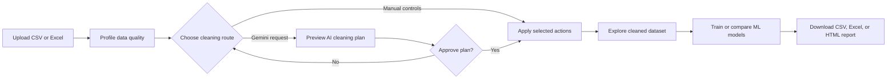
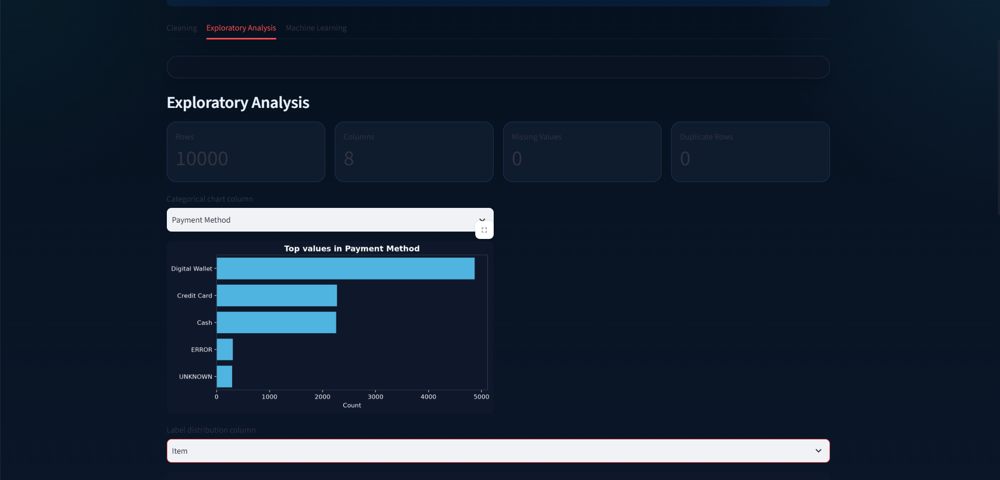
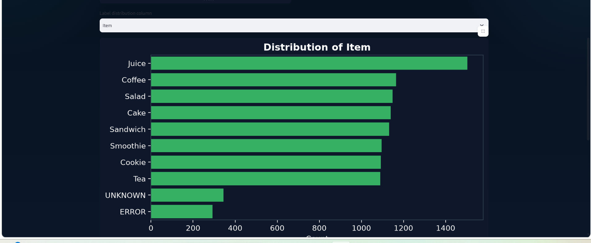
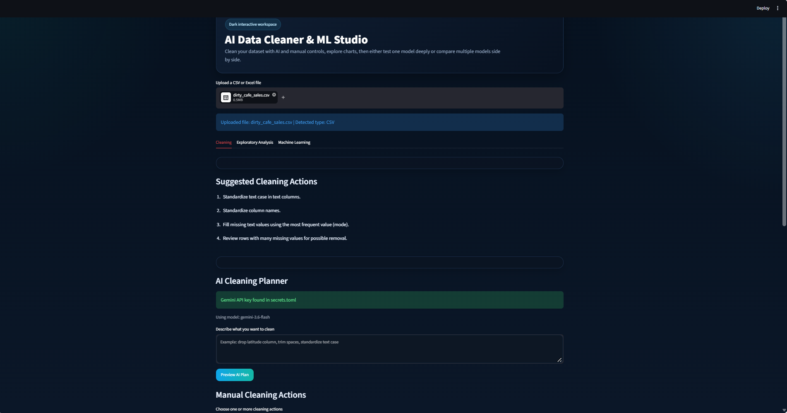

<div align="center">

# AI Data Cleaner & ML Studio

### An interactive AI-assisted workspace for data cleaning, visual exploration, and machine-learning experimentation

[](https://www.python.org/)
[](https://streamlit.io/)
[](https://pandas.pydata.org/)
[](https://scikit-learn.org/)
[](https://ai.google.dev/)

[Features](#features) •
[Workflow](#workflow) •
[Screenshots](#screenshots) •
[Quick start](#quick-start) •
[Tech stack](#tech-stack) •
[Author](#author)

</div>

---

## Why this project?

Business and operational datasets often arrive with duplicate rows, missing values, inconsistent text labels, unclean column names, and mixed data types. Preparing that data manually slows down reporting, analysis, and machine-learning work.

**AI Data Cleaner & ML Studio** provides one interactive workspace to:

- Upload CSV or Excel data
- Identify common data-quality issues
- Apply manual cleaning actions
- Ask Gemini to create a structured cleaning plan from plain English
- Preview the expected impact before applying an AI plan
- Explore distributions and dataset-quality metrics
- Train and compare classification models
- Export the cleaned data and a cleaning report

> Built as a hands-on business analytics and machine-learning portfolio project by **Vivek Parmar**.

---

## Features

<table>
<tr>
<td width="50%" valign="top">

### Data ingestion

- CSV upload support
- Excel support for `.xls`, `.xlsx`, and `.xlsm`
- Automatic file-type detection
- Live preview of the cleaned dataset
- CSV and Excel downloads

</td>
<td width="50%" valign="top">

### Data cleaning

- Remove exact duplicate rows
- Trim unwanted spaces
- Standardize text capitalization
- Standardize column names
- Drop selected columns
- Reset to the original uploaded data
- Remove rows with heavy missingness

</td>
</tr>
<tr>
<td width="50%" valign="top">

### Missing-value strategy

- **Text / category columns:** fill missing values with that column’s most frequent value (**mode**)
- **Numeric columns:** fill missing values with the **median**
- Empty text columns remain unchanged instead of receiving artificial values
- Cleaning notes explain which columns were affected

</td>
<td width="50%" valign="top">

### AI cleaning planner

- Gemini-powered natural-language requests
- Structured JSON cleaning plan
- Preview before changes are applied
- Finalize or reject the proposed plan
- Only approved actions change the dataset

</td>
</tr>
<tr>
<td width="50%" valign="top">

### Exploratory analysis

- Row, column, missing-value, and duplicate metrics
- Categorical frequency bar charts
- Numeric distribution histograms
- Label distribution visualizations
- Numeric-like text conversion for analysis

</td>
<td width="50%" valign="top">

### ML Studio

- Single-model analysis
- Multi-model comparison
- Accuracy and weighted F1 score
- Classification report
- Confusion matrix
- Text, categorical, and numeric preprocessing pipelines

</td>
</tr>
</table>

---

## Workflow



---

## Screenshots

### 1. Exploratory analysis: payment-method distribution

The EDA workspace displays business-friendly categorical counts. In this example, **Digital Wallet** is the most common payment method, followed by Credit Card and Cash.

<p align="center">
  
</p>

### 2. Exploratory analysis: item distribution

The application visualizes product/item distribution to help users identify common categories and unusual labels such as `UNKNOWN` or `ERROR` that may require business review.

<p align="center">
  
</p>

### 3. Cleaning workspace

Add your full cleaning-workspace screenshot after saving it with this filename:

```text
assets/cleaning-workspace.png
```

<p align="center">
  
</p>

---

## Mode-based missing values

Rather than replacing missing text values with a generic label such as `Unknown`, the app uses the **mode**—the most frequent valid value in the same column.

| Example column | Existing values | Missing-value method | Result |
|---|---|---|---|
| Payment Method | Digital Wallet, Credit Card, Cash | Most frequent value | Missing values become `Digital Wallet` |
| Location | Takeaway, In-store | Most frequent value | Missing values become the top observed location |
| Quantity | 1, 2, 4, 5 | Median | Missing values become the median value |

This provides a consistent starting point for cleaning, while the generated report reminds users to review all imputation assumptions before making business decisions.

---

## Machine-learning models

| Model | Best use case in this app |
|---|---|
| Logistic Regression | Explainable classification baseline |
| Linear SVC | High-dimensional text and categorical features |
| Random Forest | Nonlinear relationships and robust baseline comparison |
| Gradient Boosting | Strong predictive classification benchmark |
| Decision Tree | Interpretable rule-based model |
| K-Nearest Neighbors | Similarity-based classification |
| Multinomial Naive Bayes | Text-focused classification with TF-IDF features |

### Preprocessing pipeline

```text
Numeric columns      → Median imputation → Scaling when required
Categorical columns  → Most-frequent imputation → One-hot encoding
Optional text column → Missing-value handling → TF-IDF vectorization
Target column        → Label encoding → Stratified train/test split
```

---

## Project structure

```text
ai-data-cleaner-ml-studio/
│
├── .streamlit/
│   └── secrets.toml.example      # Safe secret template only
├── assets/
│   ├── eda-payment-method.png
│   ├── eda-item-distribution.png
│   └── cleaning-workspace.png
├── .gitignore
├── app.py
├── requirements.txt
└── README.md
```

---

## Quick start

### 1. Clone the repository

```bash
git clone [https://github.com/vivek0717/ai-data-cleaner-ml-studio.git](https://github.com/vivek0717/ai-data-cleaner-ml-studio.git)
cd ai-data-cleaner-ml-studio
```

### 2. Create a virtual environment

For Windows PowerShell:

```powershell
py -3.12 -m venv .venv
Set-ExecutionPolicy -Scope Process -ExecutionPolicy RemoteSigned
.\.venv\Scripts\Activate.ps1
```

### 3. Install packages

```powershell
python -m pip install --upgrade pip
python -m pip install -r requirements.txt
```

### 4. Configure Gemini safely

Create this local file:

```text
.streamlit/secrets.toml
```

Add your own API key:

```toml
GEMINI_API_KEY = "YOUR_GEMINI_API_KEY"
```

> Never commit `.streamlit/secrets.toml`. The repository includes a safe example template only.

### 5. Run the app

```powershell
streamlit run app.py
```

Open the local URL provided by Streamlit, usually:

```text
http://localhost:8501
```

---

## Technology stack

| Category | Technologies |
|---|---|
| Front end | Streamlit |
| Language | Python |
| Data processing | Pandas, NumPy |
| Spreadsheet support | OpenPyXL, XlsxWriter, XLrd, PyXLSB, ODFPy |
| AI planning | Google Gen AI SDK, Gemini API |
| Visualization | Matplotlib, Seaborn |
| Machine learning | Scikit-learn |
| Version control | Git and GitHub |

---

## Responsible use notes

This tool accelerates exploratory cleaning and machine-learning experiments. It does not replace business validation or data-governance review.

Before using an output for operational, financial, or high-impact decisions:

- Review rows and columns removed during cleaning
- Confirm that mode/median imputation makes sense for the business context
- Avoid imputing unique identifiers such as customer IDs, emails, account numbers, or transaction IDs
- Validate target labels and check class balance before training models
- Assess metrics beyond accuracy, especially for imbalanced classification problems

---

## Roadmap

- [x] CSV and Excel file upload
- [x] Manual cleaning actions
- [x] Mode-based text imputation
- [x] Median-based numeric imputation
- [x] Gemini AI cleaning planner
- [x] EDA charts and data-quality metrics
- [x] Classification model experiments
- [x] CSV, Excel, and HTML report downloads
- [ ] Streamlit Cloud deployment
- [ ] Sample datasets
- [ ] Per-column cleaning configuration
- [ ] Date parsing and validation rules
- [ ] Outlier detection
- [ ] Feature-importance charts
- [ ] Unit tests and GitHub Actions

---

## Author

<div align="center">

### Vivek Parmar

**MS in Business Analytics**  
SQL • Python • Tableau • Data Storytelling • Machine Learning  
Aspiring Data Consultant

[GitHub Profile](https://github.com/vivek0717) • [Project Repository](https://github.com/vivek0717/ai-data-cleaner-ml-studio)

</div>

---

If this project helped you, consider starring the repository.
